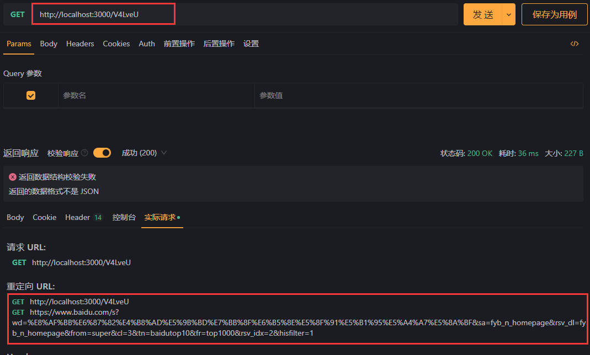

## 项目简介

`eshort`是一个以高可用优先，功能相对完备的，可用作短链接的项目。 它依赖，关系型数据库(设置唯一索引)，`Redis`，`RabbitMQ`。 它使用了`gin`作为基础框架，`gorm`作为`ORM`
，这两个框架受众多，更方便大家对`eshort`进行二开。

该项目的目录结构脱胎于`egin`，一个对`gin`进行了简易封装的骨架框架，过于简陋暂未开源。所以你会看到部分与该项目无关，但是很有可能会用得上的代码，如里面包含了部分登录注册和`session`相关的组件。
可自行进行删除或改造使用。

## 特点

1. 因考虑到扩展性，在部分地方并未使用更快的程序内存，而是使用的`Redis`。
2. 将业务抽象出来了，使得`eshort`可以不仅是一个短链接项目，它也可以是一个短口令项目，只要实现一套接口即可。
3. 使用了布隆过滤器进行访问过滤。
4. 仿照`Redis`的`LRU`，实现了一个更为简易的`LRU`算法，用于加速访问。使用的程序内存。
5. 提前生成一批可用`key`，放在了`redis`中。

这里主要讲下第二点。将短链接业务抽象出来，就是将一长串内容映射到一个长度较小的`key`上，通过访问这个`key`，可以还原出那一长串内容。
这套框架可以满足在不动整体流程框架的前提下，完成此类型业务，因为它将主要业务抽象了出来。
```
├─app
│  ├─biz
│  │  │  Biz.go#业务初始化代码
│  │  │  business.go#业务接口
│  │  └─strategy
│  │       passphrase.go#短口令实现
│  │       shorturl.go#短链接实现
```
你可以根据业务自行修改`strategy`文件夹下的文件，也可以在此文件夹下新增实现自己的业务。
新增完后，记得在`Biz.go`中和`.env`文件中修改对应配置。
## 文档

### 项目启动与滚动发布

这两项功能都需要进到项目根目录后执行命令。 与启动gin一致：
> go run main.go

滚动发布：
> su root ./eshort.sh restart

### 路由

该项目只有两条路由，路由配置在/routes/api_route.go中。

```go
func SetupApiRoute(route *gin.Engine) {
    index := controller.Index{}
    route.POST("/generate", index.Generate)
    route.GET("/:key", index.Agent)
}
```

`generate` 负责将数据转化为`key`。入参为`data`和`exp`，分别为转换数据和过期时间，exp单位为天。 调用示例：


访问接口，会根据业务实现判断是普通响应还是重定向。

### 项目目录
```
├─app                  
│  ├─biz#业务实现的接口，选择逻辑都放在这里
│  │  └─strategy#不同的业务实现都放在这里
│  ├─http #控制器和中间件
│  │  ├─controller     
│  │  │  └─base        
│  │  └─middlewares    
│  ├─models#数据库模型
│  │  ├─admin          
│  │  └─eshort         
│  ├─requests #请求的表单验证相关
│  │  └─validata_rules 
│  └─services #业务服务相关
│      └─shortkey #短 key 生成相关策略
│          └─factory   
├─bootstrap #整个框架必备组件及业务的初始化。与业务有关的在其 app.go 中。           
├─config    #将各配置加载到内存中。           
├─pkg  #封装的工具包                
│  ├─app               
│  ├─app_file_path     
│  ├─array_tool        
│  ├─auth              
│  ├─base_model        
│  ├─config            
│  ├─csrf_token        
│  ├─easylogger        
│  ├─ehash             
│  ├─eredis            
│  ├─eviction          
│  │  └─elru           
│  ├─helpers           
│  ├─logger            
│  ├─model             
│  ├─mtime             
│  ├─murmur3           
│  ├─pagination        
│  ├─password          
│  ├─rabbitmq          
│  ├─response          
│  ├─session           
│  ├─struct_tool       
│  └─types             
└─routes               
```
## 开发计划

1. 项目目录和调用结构优化
2. 完备的测试用例
3. 消息的发布和统计
4. 定期将过期数据状态设置为0
